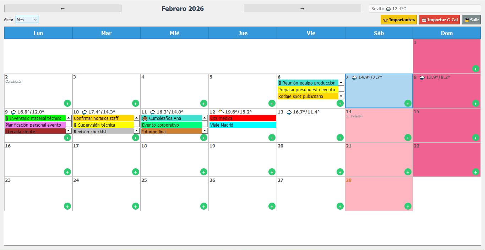

# 📅 MiniCalendar — Secure Cloud-Based Desktop Calendar


**MiniCalendar** is a secure, cloud-synced desktop scheduling application built with **Python + PyQt5**, backed by a remote **MySQL** database and protected with **SSL/TLS** encryption.

It was designed to solve real workflow inefficiencies in professional event and production management environments.

This project demonstrates production-oriented architecture, cloud integration, secure authentication, and full deployment as a Windows executable.

---

## 🟢 Production Status

MiniCalendar is currently deployed and actively used in a professional production environment for daily event coordination, logistics planning, and supplier management.

The application runs with a remote cloud database and supports real multi-device synchronization, validating its stability and real-world usability.

---

## 📸 Screenshots

> **Note:** For the best viewing experience, it is recommended to use GitHub's light theme to see all interface details.

<p align="center">
  <em>Main calendar view in "Month" mode, showcasing the event heatmap and organization.</em><br><br>
  
</p>

---

## 🚀 Why This Project Matters

This is not a simple GUI calendar. It showcases:

*   **Real client–server architecture**
*   **Remote cloud database integration**
*   **Encrypted database connections (SSL/TLS)**
*   **Secure password hashing (bcrypt)**
*   **API integration** (weather + Google Calendar import)
*   **Modular, scalable project structure**
*   **Full packaging & deployment (.exe)**

It reflects how real-world software is built, secured, and shipped.

---

## 💡 Problem It Solves

Built for a professional audiovisual production workflow where the user needed:

*   Event coordination
*   Supplier & client meeting management
*   Internal development scheduling
*   Logistics planning

**Limitations identified in standard calendar tools:**

*   Limited visual categorization
*   Overloaded interface
*   Insufficient visible description space
*   Lack of contextual integrations

**MiniCalendar focuses on simplicity + power.**

---

## ✨ Core Features

*   ☁️ **Cloud-hosted MySQL database**
*   🔐 **SSL/TLS encrypted connection**
*   🔑 **Secure authentication with bcrypt**
*   📅 **Full CRUD event system**
*   🎨 **Advanced color categorization**
*   🖱️ **Drag & drop event rescheduling**
*   📎 **File attachments per event**
*   🌦️ **Weather integration (Open-Meteo API)**
*   🔌 **Google Calendar import capability**
*   🌙 **Automatic dark mode support**

---

## ⚙️ Installation & Setup

1.  **Clone the repository**
    ```bash
    git clone https://github.com/[YOUR_USERNAME]/MiniCalendar-Pro-Desktop.git
    cd MiniCalendar-Pro-Desktop
    ```

2.  **Install dependencies**
    ```bash
    pip install -r requirements.txt
    ```

3.  **Configure Environment Variables**
    Create a `.env` file in the root directory with your database credentials:
    ```ini
    DB_HOST=your_cloud_host_address
    DB_USER=your_db_user
    DB_PASS=your_db_password
    DB_NAME=minicalendar_db
    DB_PORT=3306
    ```

    > **⚠️ Important: Required Files**
    > You must place the following files in the project's root directory for the application to run correctly:
    > *   `ca.pem`: The SSL certificate file required for a secure connection to the MySQL database (as used in `database/conexion_db.py`).
    > *   `credentials.json`: The Google API credentials file needed for the "Google Calendar Import" feature (as used in `logic/google_calendar.py`).

4.  **Run the Application**
    ```bash
    python main.py
    ```

---

## 📦 Building the Executable

This project is designed to be packaged into a single `.exe` file for easy distribution on Windows. The `resource_path` function in the code ensures that all assets are correctly bundled.

To build the executable, run the following command using PyInstaller:

```bash
# This command bundles the app, its UI assets, and the SSL certificate.
pyinstaller --noconsole --onefile --name="MiniCalendar" --add-data "ui;ui" --add-data "ca.pem;." main.py
```

The final `MiniCalendar.exe` will be located in the `dist` folder.

---

## 🏗️ Architecture Overview

```bash
MiniCalendar/
├── ui/             # GUI Layer (Presentation)
├── logic/          # Business Logic Layer
├── database/       # Data Access Layer
├── utils/          # Config & Utilities
├── main.py         # Entry Point
└── .env            # Environment Configuration
```

### Engineering Principles Applied

*   **Separation of concerns**
*   **Clean layered structure**
*   **Secure environment variable management**
*   **Cloud-first approach**
*   **Production-style deployment**

---

## 🛠️ Tech Stack

| Category | Technology |
| :--- | :--- |
| **Language** | Python 3.x |
| **GUI** | PyQt5 |
| **Database** | MySQL 8.0 (Cloud Hosted) |
| **Security** | SSL/TLS + bcrypt |
| **APIs** | Open-Meteo + Google Calendar |
| **Packaging** | PyInstaller |

---

## 🧠 What This Project Demonstrates

*   Ability to design secure client–database systems
*   Experience working with cloud database providers
*   Understanding of authentication & encryption
*   API consumption & external service integration
*   Desktop application architecture
*   Shipping production-ready software

---

## 👨‍💻 Author

**José Ángel Carrión Algaba**
*Software Developer — Python | Cloud | Secure Systems*

 Spain
🌍 Open to national & international opportunities

[LinkedIn Profile](https://www.linkedin.com/in/jose-angel-carrion-algaba)